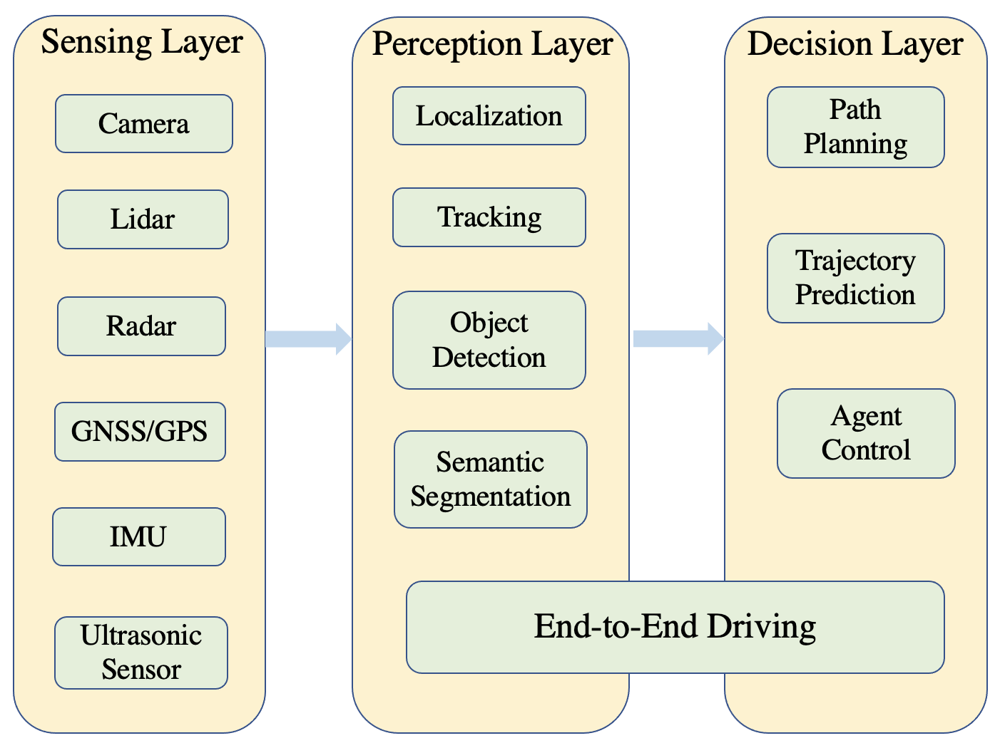
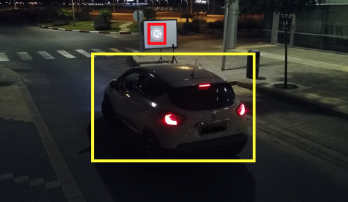
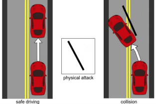
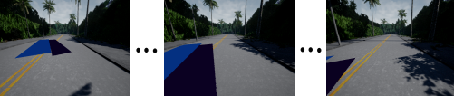
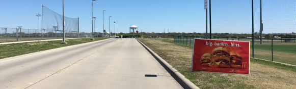
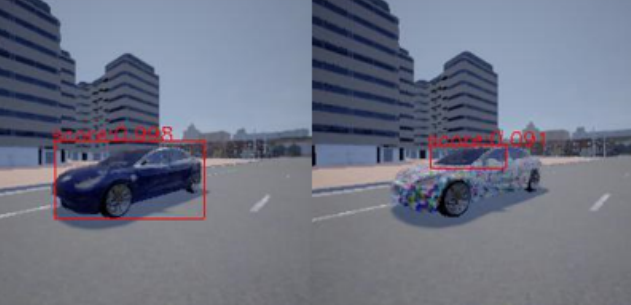
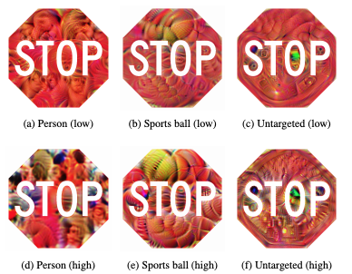
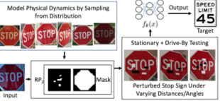

# Summary

Autonoumous driving approaches can be divided into two main paradigms depending on their level of modularity. One is modular pipelines and another is end-to-end driving/imitation learning. 

Modular pipeline are systems that deploy an array of advanced computer vision algorithms used for perception, planning and control. AI drivers rely on modules with identifiable responsibilities. For instance, the perception module involves more specific sub-tasks such as [oject detection](https://arxiv.org/abs/1506.01497), [traffic sign recognition](https://openaccess.thecvf.com/content_cvpr_2016/html/Zhu_Traffic-Sign_Detection_and_CVPR_2016_paper.html), [semantic segmentation](https://openaccess.thecvf.com/content_cvpr_2015/html/Long_Fully_Convolutional_Networks_2015_CVPR_paper.html), [depth estimation](https://ieeexplore.ieee.org/abstract/document/8296962?casa_token=6qLx_FDS75cAAAAA:Se5A8sWzRWgMhB2k-s19Yt3Tz4mtQQcWwuL7vXxmZBPdBMrWVb3QWHPolkLrkkhfUy6UHn-9), and [tracking](https://www.cv-foundation.org/openaccess/content_iccv_2015/html/Xiang_Learning_to_Track_ICCV_2015_paper.html), etc. As shown in the image below. 

End-to-end learning for self-driving cars has been explored
since the late 1980s. This approach is to train function apporximators to map sensory input to control commands. More specifically, consider a driving controller, at each time step t, the controller receives an obervation $ o_t $ and takes an action $a_t$. The approximator function could be wrote as: $a_t = E(o_t)$. Systems in this domain is to learn by imitating a human or an expert driver. 

The following papers are related to end-to-end driving models.

Some are in suburban and some are in urban environments: 

- suburban: 

[An autonomous land vehicle in a neural network.](https://apps.dtic.mil/sti/citations/ADA218975) In NIPS, 1988.

[Off-road obstacle avoidance through end-to-end learning. ](https://citeseerx.ist.psu.edu/viewdoc/download?doi=10.1.1.69.8556&rep=rep1&type=pdf)In Advances in Neural Information Processing Systems, 2006.

[DeepDriving: Learning affordance for direct perception in autonomous driving.](https://openaccess.thecvf.com/content_iccv_2015/html/Chen_DeepDriving_Learning_Affordance_ICCV_2015_paper.html) In ICCV, 2015

[End to end learning for self-driving cars.](https://arxiv.org/abs/1604.07316) arXiv:1604.07316, 2016.

[Query-efficient imitation learning for end-to-end simulated driving.](https://arxiv.org/abs/1605.06450) In AAAI, 2017.

[Learning a deep neural net policy for end-to-end control
of autonomous vehicles.](https://ieeexplore.ieee.org/abstract/document/7963716?casa_token=9Q7WqEbztJUAAAAA:E7WF17Wt4SGy8xhsE-F2bjTZKHeUEosNZAf0rUgEe_8JL43caGSFKUi8TjqZU-9NYps-5SYA) In IEEE American Control
Conference, 2017.

[Agile autonomous driving using end-to-end deep imitation learning. In RSS, 2018.](https://arxiv.org/abs/1709.07174)

- urban environment

[End-to-End Driving Via Conditional Imitation Learning. ](https://ieeexplore.ieee.org/abstract/document/8460487?casa_token=nn82eOADRbcAAAAA:_255fn3lZD8nvLqkyda5_nAJ15QNzbpC05bbgfLgpZltJmWQ-BkYuhoNxutl1rsSzvfv2rJ8)In 2018 IEEE International Conference on Robotics and Automation.

[CIRL: Controllable imitative reinforcement learning for vision-based self-driving.](https://openaccess.thecvf.com/content_ECCV_2018/html/Xiaodan_Liang_CIRL_Controllable_Imitative_ECCV_2018_paper.html) In ECCV, 2018.

[Conditional affordance learning for driving in urban environments.](http://proceedings.mlr.press/v87/sauer18a.html) In CoRL, 2018.

[ChauffeurNet: Learning to drive by imitating the best and synthesizing the worst.](https://arxiv.org/abs/1812.03079) In RSS, 2019.

[Exploring the limitations of behavior cloning for autonomous driving.](https://openaccess.thecvf.com/content_ICCV_2019/html/Codevilla_Exploring_the_Limitations_of_Behavior_Cloning_for_Autonomous_Driving_ICCV_2019_paper.html) In ICCV, 2019.

[Learning by cheating.](http://proceedings.mlr.press/v100/chen20a.html) In Conference on Robot Learning, 2020.

## Attacks

### Physical attacks on sensors

Target sensor
- Camera
  
  [Remote attacks on automated vehicles sensors: Experiments on camera and lidar](https://www.semanticscholar.org/paper/Remote-Attacks-on-Automated-Vehicles-Sensors-%3A-on-Petit-Stottelaar/e06fef73f5bad0489bb033f490d41a046f61878a) Black Hat Europe, Amsterdam, Netherlands, Nov. 2015.

(Note: Extensive light blinding attack
Blinding. Make images overexposed and not recognizable; Cause temperature damage on cameras; Relaying signals of objects from another position. LiDAR detects ’ghost’ objects. )

[MobilBye: Attacking ADAS with Camera Spoofing](https://arxiv.org/abs/1906.09765)

(Note: Using a projector to project deceptive traffic signs onto ADAS. The vehicle recognized the deceptive traffic signs as real signs)

- LiDAR

[Illusion and dazzle: Adversarial optical channel exploits against lidars for automotive applications](https://link.springer.com/chapter/10.1007/978-3-319-66787-4_22) 

(Note: Blinding attacks by strong light with same wavelength as LiDAR. LiDAR cannot perceive objects from the direction of light source)

[Adversarial Sensor Attack on LiDAR-based Perception in Autonomous Driving](https://dl.acm.org/doi/abs/10.1145/3319535.3339815)

(Note: White-box, apply lidar spoof by sloving an optimization problem )

- GPS
  
[A GPS Spoof- ing generator using an open sourced vector tracking-based receiver](https://www.ncbi.nlm.nih.gov/pmc/articles/PMC6767349/)

(Note: Using GPS-spoofing device to inject fake signals. Navigation system is manipulated UAV)

- Radar
  
[Can You Trust Autonomous Vehicles : Contactless Attacks against Sensors of Self-driving Vehicle](https://www.semanticscholar.org/paper/Can-You-Trust-Autonomous-Vehicles-%3A-Contactless-of-Yan/a618dcb13ec42900209e7aa3f88490b587631e13)

(Note: Fabricating fake signals. Sensors detect objects at wrong distance.)

### Adversarial attacks

Attack Target
- E2E driving model
  
[Deepbillboard: Systematic physical-world testing of autonomous driv- ing systems](https://arxiv.org/abs/1812.10812) in Proc. ICSE, Seoul, South Korea, Jun. 2020

(Note: Replacing original billboard with adversarial billboard by solving an optimization problem. White-box. Digital dataset: Dave,Kitti,Udacity)

[Attacking vision-based perception in end-to-end autonomous driving models](https://arxiv.org/abs/1910.01907) Journal of Systems Architecture, 101766.

(Note: Drawing black strips on the road by Bayesian Optimization method.Blackbox. In CARLA)

[Finding physical adversarial examples for autonomous driving with fast and differentiable image compositing](https://arxiv.org/abs/2010.08844)

(Note: Drawing black strips on the road by Gradient-based Optimization method.Blackbox. In CARLA)

[PhysGAN: Generating Physical-World-Resilient Adversarial Examples for Autonomous Driving](https://arxiv.org/abs/1907.04449)

(Note: Generate adversarial billboard by GAN. Whitebox. In realworld. )

[Delving into transferable adversarial examples and black-box attacks](https://arxiv.org/abs/1611.02770)

(Note:Adding poisoning images with triggers into training data.  ResNet-50, ResNet-101, ResNet-152, GoogLeNet, VGG-16. In dataset.)

- Object detection
  
[Physical adversarial attack on vehicle detector in the carla simulator](https://arxiv.org/abs/2007.16118)

(Note: Drawing adversarial texture on other vehicles by a discrete search method. White-box. In CARLA.)

[Talk Proposal: Towards the Realistic Evaluation of
Evasion Attacks using CARLA](https://arxiv.org/pdf/1904.12622.pdf)

(Note: Drawing adversarial pattern on pedestrain. White-box. In CARLA.)

- 3D Object detection

[Towards Robust LiDAR-based Perception in Autonomous Driving: General Black-box Adversarial Sensor Attack and Countermeasures](https://www.usenix.org/conference/usenixsecurity20/presentation/sun)

(Note:Inserting attack trace into original point clouds. Black-box, spoofing, in Carlo)

- Traffic sign recognition 

[Shapeshifter: Robust physical adversarial attack on faster R-CNN object detector](https://arxiv.org/abs/1804.05810)

(Note: Replacing true traffic signs with adversarial traffic signs generated by solving an optimization problem. White-box. In real world.)

[Robust physical-world attacks on deep learning visual classificatio](https://arxiv.org/pdf/1707.08945.pdf). in Proc. CVPR, Salt Lake City, UT, USA, Jun. 2018

(Note: Pasting adversarial stickers that generated by optimization-based approach on traffic signs. White-box.)

### Cyberattacks

[Impact of cyberattacks on safety and stability of connected and automated vehicle platoons under lane changes](https://www.sciencedirect.com/science/article/abs/pii/S000145752031681X)

(Note: Emulated message falsification, V2X network attack within CAV simulation platform.)

[A survey of security and privacy in connected vehicles](https://www.researchgate.net/publication/283556480_A_Survey_of_Security_and_Privacy_in_Connected_Vehicles)
