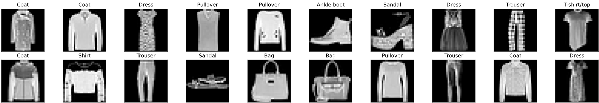
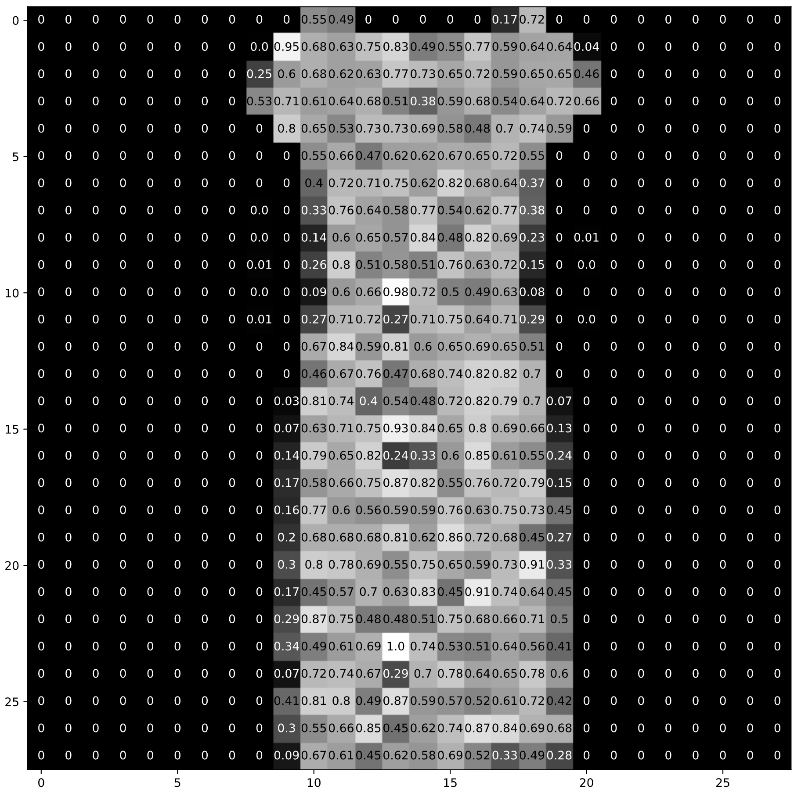
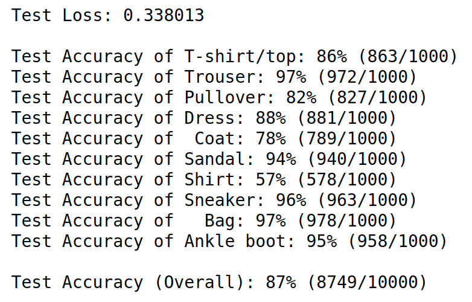

PyTorch has some built-in datasets that you can use, and [FashionMNIST](https://github.com/zalandoresearch/fashion-mnist) is one of them; Google Colab is a good tool for beginners, so all we have to do is, in the Colab notebook, load these images using the FashionMNIST dataset class and load the data in batches with a DataLoader.

The first step in any classification problem is to look at the dataset you are working with. This will give you some details about the format of images and labels, as well as some insight into how you might approach defining a network to recognize patterns in such an image set.

## Load the data
### Dataset class and Tensors
**torch.utils.data.Dataset** is an abstract class representing a dataset. The FashionMNIST class is an extension of this Dataset class and it allows us to 1. load batches of image/label data, and 2. uniformly apply transformations to our data, such as turning all our images into Tensor's for training a neural network. Tensors are similar to numpy arrays, but can also be used on a GPU to accelerate computing.

Let's see how to construct a training dataset.
```Python
# Basic libraries
import torch
import torchvision

# Data loading and transforming
from torchvision.datasets import FashionMNIST
from torch.utils.data import DataLoader
from torchvision import transforms

# The output of torchvision datasets are PILImage images of range [0, 1]. 
# We transform them to Tensors for input into a CNN

## Define a transform to read the data in as a tensor
data_transform = transforms.ToTensor()

# choose the training and test datasets
train_data = FashionMNIST(root='./data', train=True,
                                   download=False, transform=data_transform)
# Print out some stats about the training data
print('Train data, number of images: ', len(train_data))
```

### Data iteration and batching

Next, we'll use torch.utils.data.DataLoader , which is an iterator that allows us to batch and shuffle the data.

In the next cell, we shuffle the data and load in image/label data in batches of size 20.

```python
# prepare data loaders, set the batch_size
batch_size = 20

train_loader = DataLoader(train_data, batch_size=batch_size, shuffle=True)

# specify the image classes
classes = ['T-shirt/top', 'Trouser', 'Pullover', 'Dress', 'Coat', 'Sandal', 'Shirt', 'Sneaker', 'Bag', 'Ankle boot']
```

### Visualize some training data
We will iterate over the training dataset, loading a random batch of image/label data, using dataiter.next(). It then plots the batch of images and labels in a 2 x batch_size/2 grid.
```python
import numpy as np
import matplotlib.pyplot as plt

%matplotlib inline
    
# obtain one batch of training images
dataiter = iter(train_loader)
images, labels = dataiter.next()
images = images.numpy()

# plot the images in the batch, along with the corresponding labels
fig = plt.figure(figsize=(25, 4))
for idx in np.arange(batch_size):
    ax = fig.add_subplot(2, batch_size/2, idx+1, xticks=[], yticks=[])
    ax.imshow(np.squeeze(images[idx]), cmap='gray')
    ax.set_title(classes[labels[idx]])
```


### View an image in more detail
Each image in this dataset is a 28x28 pixel, normalized, grayscale image.

A note on normalization
Normalization ensures that, as we go through a feedforward and then backpropagation step in training our CNN, that each image feature will fall within a similar range of values and not overly activate any particular layer in our network. During the feedfoward step, a network takes in an input image and multiplies each input pixel by some convolutional filter weights (and adds biases!), then it applies some activation and pooling functions. Without normalization, it's much more likely that the calculated gradients in the backpropagation step will be quite large and cause our loss to increase instead of converge.

```python
# select an image by index
idx = 2
img = np.squeeze(images[idx])

# display the pixel values in that image
fig = plt.figure(figsize = (12,12)) 
ax = fig.add_subplot(111)
ax.imshow(img, cmap='gray')
width, height = img.shape
thresh = img.max()/2.5
for x in range(width):
    for y in range(height):
        val = round(img[x][y],2) if img[x][y] !=0 else 0
        ax.annotate(str(val), xy=(y,x),
                    horizontalalignment='center',
                    verticalalignment='center',
                    color='white' if img[x][y]<thresh else 'black')
```
<p align="center">

</p>

### Define the network architecture
For a convolutional neural network, we'll use a simple series of layers:

Convolutional layers

Maxpooling layers

Fully-connected (linear) layers

```python 
import torch.nn as nn
import torch.nn.Functional as F

class Net(nn.Module):
    
    def __init__(self):
        super(Net, self).__init__

        self.conv1 = nn.Conv2d(1,10,3)
        self.pool = nn.Maxpool2d(2,2)
        self.conv2 = nn.Conv2d(10,20,3)
        self.fc1 = nn.Linear(20*5*5, 20)
        self.fc1_dropout = nn.Dropout(p=0.4)
        self.fc2 = nn.Linear(50, 10)
    
    def forward(self,x):
        x = self.pool(F.relu(self.conv1(x)))
        x = self.pool(F.relu(self.conv2(x)))
        x = x.view(x.size(0), -1)
        x = F.relu(self.fc1(x))
        x = self.fc1_drop(x)
        x = self.fc2(x)

        return x

net = Net()
print(net)
```

Net(
  
  (conv1): Conv2d(1, 10, kernel_size=(3, 3), stride=(1, 1))
  
  (pool): MaxPool2d(kernel_size=2, stride=2, padding=0, dilation=1, ceil_mode=False)
  
  (conv2): Conv2d(10, 20, kernel_size=(3, 3), stride=(1, 1))
  
  (fc1): Linear(in_features=500, out_features=50, bias=True)
  
  (fc1_drop): Dropout(p=0.4, inplace=False)
  
  (fc2): Linear(in_features=50, out_features=10, bias=True)
)


### Specify the loss function and optimizer
For a classification problem like this, one typically uses cross entropy loss, which can be defined in code like: **criterion = nn.CrossEntropyLoss().** PyTorch also includes some standard stochastic optimizers like **stochastic gradient descent** and **Adam**.
```python
import torch.optim as optim
#specify loss function
#use cross entropy which combines softmax and NLL loss
criterion = nn.CrossEntropy()
#specify optimizer
#stochastic gradient descent with a small learning rate AND some momentum
optimizer = optim.SGD(net.paramters(), lr=0.001, momentum=0.9)
```

### A note on accuracy
It's interesting to look at the accuracy of your network before and after training. This way you can really see that your network has learned something. Let's see what the accuracy of an untrained network is (we expect it to be around 10% which is the same accuracy as just guessing for all 10 classes).

```python
#calculate the accuracy before training
correct = 0
total = 0

# Iterate through test dataset
for images, label in test_loader:
    #forward pass to get outputs
    outputs = net(images)
    _, predicted = torch.max(outputs.data, 1)

    #count up total number of correct label
    total += labels.size(0)
    correct += (predicted == labels).sum()
#convert 'correct' from a Tensor into a scalar, use .item()
accuracy = 100*correct.item()/total

# print it out!
print('Accuracy before training: ', accuracy)
```


### Train the Network
Below, we've defined a train function that takes in a number of epochs to train for.The number of epochs is how many times a network will cycle through the entire training dataset.

Inside the epoch loop, we loop over the training dataset in batches; recording the loss every 1000 batches.

Here are the steps that this training function performs as it iterates over the training dataset:

- Zero's the gradients to prepare for a forward pass
- Passes the input through the network (forward pass)
- Computes the loss (how far is the predicted classes are from the correct labels)
- Propagates gradients back into the network’s parameters (backward pass)
- Updates the weights (parameter update)
- Prints out the calculated loss

```python
def train(n_epoches):
    loss_over_time = []
    for epoch in n_epoches:
        running_loss = 0.0
        inputs, labels = data
        optimizer.zero_grad()
        outputs = net(data)
        loss = criterion(outputs, labels)
        loss.backward()
        optimizer.step()
        running_loss += loss.item()

        if batch_i%1000 ==999:
            avg_loss = running_loss/1000
            #record and print the avg loss over the 1000 batches
            loss_over_time.append(avg_loss)
            print('Epoch: {}, Batch: {}, Avg. Loss: {}'.format(epoch + 1, batch_i+1, avg_loss))
            running_loss = 0.0
    print('Finished Training')
    return loss_over_time

n_epochs = 20 # start small to see if your model works, initially
# call train
training_loss = train(n_epochs)
```

### Test the Trained Network
You must test your trained model on a previously unseen dataset to see if it generalizes well and can accurately classify this new dataset. For FashionMNIST, which contains many pre-processed training images, a good model should reach greater than 85% accuracy on this test dataset. If you are not reaching this value, try training for a larger number of epochs, tweaking your hyperparameters, or adding/subtracting layers from your CNN.

```python
#initialize tensor and lists to monitor test loss and accuracy
test_loss = torch.zeros(1)
class_correct = list(0. for in range(10))
class_total = list(0. for i in range(10))

#set the module to evaluation mode
net.val()

for batch_1, data in enumerate(test_loader):
    inputs, label = data
    outputs = net(input)
    loss = criterion(outputs, labels)
    test_loss = test_loss + (torch.ones(1)/(batch_i+1))*(loss.data-test_loss)

    #get the predicted class from the maximum value in the output-list of class scores
    _, predicted = torch.max(outputs.data, 1)

    #compare predictions to true label
    correct = np.squeeze(predicted.eq(labels.data.view_as(predicted)))
    # we get the scalar value of correct items for a class, by calling `correct[i].item()`
    for i in range(batch_size):
        label = labels.data[i]
        class_correct[label] += correct[i].item()
        class_total[label] += 1
print('Test Loss: {:.6f}\n'.format(test_loss.numpy()[0]))

for i in range(10):
    if class_total[i]>0:
        print('Test Accuracy of %5s: %2d%% (%2d/%2d)' % (
            classes[i], 100 * class_correct[i] / class_total[i],np.sum(class_correct[i]), np.sum(class_total[i])))
    else:
        print('Test Accuracy of %5s: N/A (no training examples)' % (classes[i]))

print('\nTest Accuracy (Overall): %2d%% (%2d/%2d)' % (
    100. * np.sum(class_correct) / np.sum(class_total),
    np.sum(class_correct), np.sum(class_total)))
```
<p align = center>

</p>


